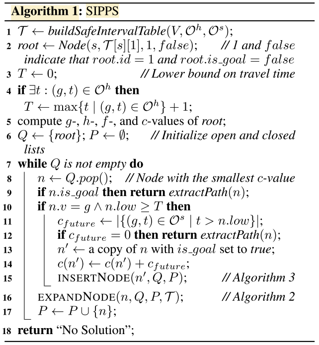
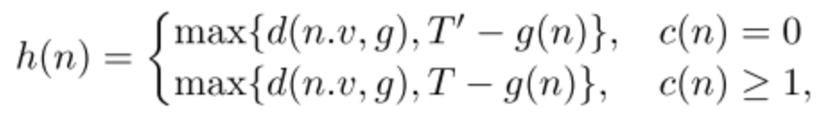

# SIPPS Python Implementation

## SIPPS Algorithm

## Credits

- [MAPF-LNS2 Paper](https://ojs.aaai.org/index.php/AAAI/article/view/21266)
- [MAPF-LNS2 Code C++](https://github.com/Jiaoyang-Li/MAPF-LNS2)